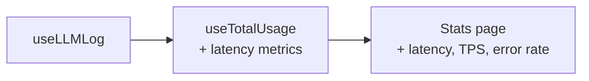
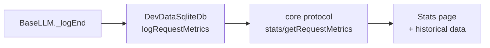
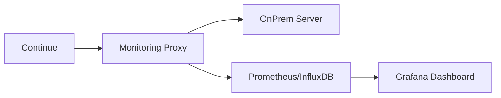

# Performance Monitoring — Continue Extension + OnPrem LLM Models

> **Status:** Research / Proposal  
> **Last updated:** 2026-08-03  
> **Applies to:** Custom fork v2.0.4+ (branch `release-v2.0.0`)

---

## 1. Hiện trạng: Những gì đã có sẵn

Continue đã có một số infrastructure đo lường, nhưng **chưa đủ** cho performance monitoring OnPrem:

| Thành phần | File | Mô tả | Hạn chế |
|---|---|---|---|
| **`DevDataSqliteDb`** | `core/data/devdataSqlite.ts` | Ghi `promptTokens` + `generatedTokens` vào SQLite local | Chỉ đếm tokens, **không có latency/TTFT/tokens_per_sec** |
| **`DataLogger`** | `core/data/log.ts` | Ghi event `chatInteraction`, `toolUsage`, `editOutcome` ra file JSONL | Chỉ log cấu trúc, không có metrics thời gian thực |
| **`useLLMLog`** | `gui/src/hooks/useLLMLog.ts` | Accumulate `startChat`, `chunk`, `success/error/cancel` interactions | Chỉ dùng cho Console view, không xuất metrics |
| **`useTotalUsage`** | `gui/src/hooks/useTotalUsage.ts` | Tính tổng tokens, cost từ LLM log | Chỉ tổng hợp, không có real-time |
| **Stats page** | `gui/src/pages/stats.tsx` | Hiển thị tokens/day, tokens/model | Rất cơ bản, không có latency |

### Dữ liệu đã có sẵn trong `LLMInteraction`

Khi nhìn vào `LLMInteraction` interface (từ `useLLMLog`), mỗi interaction đã có:

```typescript
interface LLMInteraction {
  start?: LLMInteractionStartChat;  // chứa timestamp, model, provider
  results: LLMResult[][];           // chunks stream
  end?: LLMInteractionSuccess       // chứa promptTokens, generatedTokens, usage, timestamp
     | LLMInteractionError
     | LLMInteractionCancel;
}
```

Từ đó ta có thể tính:
- **Latency:** `end.timestamp - start.timestamp`
- **Tokens per second:** `generatedTokens / (latencyMs / 1000)`
- **Error rate:** `count(error) / total`
- **Model breakdown:** group by `start.options.model`

---

## 2. Các phương án đề xuất

### Phương án 1: 🟢 Mở rộng Stats page (Dễ nhất, nhanh nhất)

**Mô tả:** Tận dụng dữ liệu đã có trong `useLLMLog` + `useTotalUsage`, chỉ sửa GUI.

**File cần sửa:**
- `gui/src/hooks/useTotalUsage.ts` — thêm metrics latency, tokens/sec, error rate
- `gui/src/pages/stats.tsx` — hiển thị thêm cột

**Chi tiết thay đổi:**

```typescript
// useTotalUsage.ts — bổ sung:
export interface TotalUsage {
  // ... existing fields ...
  totalLatencyMs: number;
  averageLatencyMs: number;
  tokensPerSecond: number;
  errorRate: number;
  modelBreakdown: Record<string, {
    count: number;
    avgLatencyMs: number;
    avgTokensPerSecond: number;
    errorCount: number;
    totalPromptTokens: number;
    totalGeneratedTokens: number;
  }>;
}
```

**Cách tính latency từ `LLMInteraction`:**

```typescript
// Trong useTotalUsage.ts, loop qua interactions:
for (const interaction of llmLog.interactions.values()) {
  if (interaction.start && interaction.end) {
    const startTime = new Date(interaction.start.timestamp).getTime();
    const endTime = new Date(interaction.end.timestamp).getTime();
    const latencyMs = endTime - startTime;

    const generatedTokens = interaction.end.generatedTokens || 0;
    const durationSec = latencyMs / 1000;
    const tps = durationSec > 0 ? generatedTokens / durationSec : 0;

    const model = interaction.start.options?.model || "unknown";
    // Accumulate into modelBreakdown[model]
  }
}
```

**Ưu điểm:**
- ✅ Không cần sửa core, chỉ sửa GUI
- ✅ Có thể deploy ngay, không cần rebuild extension (chỉ rebuild GUI)
- ✅ Dữ liệu đã có sẵn, chỉ cần tính toán lại

**Nhược điểm:**
- ❌ Metrics chỉ từ phía GUI (không đo được network time thực tế từ server)
- ❌ Chỉ có dữ liệu từ phiên hiện tại (không persist)
- ❌ `timestamp` trong `LLMInteractionStartChat` có thể không chính xác tuyệt đối

**Thời gian:** ~2-3 giờ

---

### Phương án 2: 🟡 Thêm metrics vào `DevDataSqliteDb` (Trung bình)

**Mô tả:** Mở rộng SQLite schema và core code để lưu metrics có persist.

**File cần sửa:**
- `core/data/devdataSqlite.ts` — thêm bảng `request_metrics`
- `core/llm/index.ts` — ghi metrics trong `_logEnd()`
- `core/protocol/core.ts` — thêm endpoint `stats/getRequestMetrics`
- `core/core.ts` — handler cho endpoint mới
- `gui/src/pages/stats.tsx` — hiển thị metrics

**Chi tiết thay đổi:**

#### Bảng SQLite mới:

```sql
CREATE TABLE IF NOT EXISTS request_metrics (
  id INTEGER PRIMARY KEY AUTOINCREMENT,
  model TEXT NOT NULL,
  provider TEXT NOT NULL,
  prompt_tokens INTEGER NOT NULL DEFAULT 0,
  generated_tokens INTEGER NOT NULL DEFAULT 0,
  latency_ms INTEGER NOT NULL DEFAULT 0,
  ttft_ms INTEGER,                    -- Time to first token (nullable)
  tokens_per_second REAL,             -- Throughput
  status TEXT NOT NULL DEFAULT 'success',  -- success / error / cancel
  error_message TEXT,
  timestamp DATETIME DEFAULT CURRENT_TIMESTAMP
);

CREATE INDEX IF NOT EXISTS idx_request_metrics_model ON request_metrics(model);
CREATE INDEX IF NOT EXISTS idx_request_metrics_timestamp ON request_metrics(timestamp);
CREATE INDEX IF NOT EXISTS idx_request_metrics_status ON request_metrics(status);
```

#### Sửa `DevDataSqliteDb`:

```typescript
// core/data/devdataSqlite.ts — thêm methods:
export interface RequestMetrics {
  model: string;
  provider: string;
  promptTokens: number;
  generatedTokens: number;
  latencyMs: number;
  ttftMs?: number;
  tokensPerSecond?: number;
  status: 'success' | 'error' | 'cancel';
  errorMessage?: string;
}

export class DevDataSqliteDb {
  // ... existing code ...

  public static async logRequestMetrics(metrics: RequestMetrics) {
    const db = await DevDataSqliteDb.get();
    await db?.run(
      `INSERT INTO request_metrics 
       (model, provider, prompt_tokens, generated_tokens, latency_ms, ttft_ms, tokens_per_second, status, error_message)
       VALUES (?, ?, ?, ?, ?, ?, ?, ?, ?)`,
      [
        metrics.model, metrics.provider,
        metrics.promptTokens, metrics.generatedTokens,
        metrics.latencyMs, metrics.ttftMs ?? null,
        metrics.tokensPerSecond ?? null,
        metrics.status, metrics.errorMessage ?? null,
      ],
    );
  }

  public static async getRequestMetrics(options: {
    model?: string;
    fromDate?: string;
    toDate?: string;
    limit?: number;
  } = {}): Promise<RequestMetrics[]> {
    const db = await DevDataSqliteDb.get();
    const conditions: string[] = [];
    const params: any[] = [];

    if (options.model) {
      conditions.push('model = ?');
      params.push(options.model);
    }
    if (options.fromDate) {
      conditions.push('timestamp >= ?');
      params.push(options.fromDate);
    }
    if (options.toDate) {
      conditions.push('timestamp <= ?');
      params.push(options.toDate);
    }

    const where = conditions.length > 0 ? `WHERE ${conditions.join(' AND ')}` : '';
    const limit = options.limit ?? 100;

    const result = await db?.all(
      `SELECT * FROM request_metrics ${where} ORDER BY timestamp DESC LIMIT ?`,
      [...params, limit],
    );
    return result ?? [];
  }

  public static async getModelPerformanceSummary(): Promise<{
    model: string;
    requestCount: number;
    avgLatencyMs: number;
    avgTokensPerSecond: number;
    totalTokensGenerated: number;
    totalTokensPrompt: number;
    errorCount: number;
    errorRate: number;
  }[]> {
    const db = await DevDataSqliteDb.get();
    const result = await db?.all(`
      SELECT 
        model,
        COUNT(*) as requestCount,
        AVG(latency_ms) as avgLatencyMs,
        AVG(tokens_per_second) as avgTokensPerSecond,
        SUM(generated_tokens) as totalTokensGenerated,
        SUM(prompt_tokens) as totalTokensPrompt,
        SUM(CASE WHEN status = 'error' THEN 1 ELSE 0 END) as errorCount,
        ROUND(100.0 * SUM(CASE WHEN status = 'error' THEN 1 ELSE 0 END) / COUNT(*), 2) as errorRate
      FROM request_metrics
      GROUP BY model
      ORDER BY requestCount DESC
    `);
    return result ?? [];
  }
}
```

#### Sửa `BaseLLM._logEnd()` trong `core/llm/index.ts`:

```typescript
// Trong _logEnd() — thêm sau khi log tokens:
private _logEnd(
  model: string,
  prompt: string,
  completion: string,
  thinking: string | undefined,
  interaction: ILLMInteractionLog | undefined,
  usage: Usage | undefined,
  error?: any,
): InteractionStatus {
  // ... existing token counting and logging ...

  // NEW: Log request metrics
  const latencyMs = interaction?.start?.timestamp 
    ? Date.now() - new Date(interaction.start.timestamp).getTime() 
    : 0;
  const generatedTokens = this.countTokens(completion);
  const durationSec = latencyMs / 1000;
  const tokensPerSecond = durationSec > 0 ? generatedTokens / durationSec : 0;

  // Don't await — fire and forget
  DevDataSqliteDb.logRequestMetrics({
    model,
    provider: this.underlyingProviderName,
    promptTokens,
    generatedTokens,
    latencyMs,
    tokensPerSecond,
    status: typeof error === 'undefined' ? 'success' : isAbortError(error) ? 'cancel' : 'error',
    errorMessage: error ? error.message : undefined,
  }).catch(e => console.debug('[metrics] Failed to log request metrics:', e));

  // ... rest of existing code ...
}
```

#### Protocol endpoint mới:

```typescript
// core/protocol/core.ts — thêm:
"stats/getRequestMetrics": [
  { model?: string; fromDate?: string; toDate?: string; limit?: number } | undefined,
  RequestMetrics[],
];
"stats/getModelPerformanceSummary": [
  undefined,
  { model: string; requestCount: number; avgLatencyMs: number; ... }[],
];
```

```typescript
// core/core.ts — thêm handler:
on("stats/getRequestMetrics", async (msg) => {
  return await DevDataSqliteDb.getRequestMetrics(msg.data);
});
on("stats/getModelPerformanceSummary", async (msg) => {
  return await DevDataSqliteDb.getModelPerformanceSummary();
});
```

**Ưu điểm:**
- ✅ Dữ liệu persist, có thể query lịch sử
- ✅ Đo từ extension host (gần server hơn GUI)
- ✅ Có thể export ra công cụ bên ngoài (Grafana, etc.)

**Nhược điểm:**
- ❌ Cần sửa core code, rebuild extension
- ❌ Chưa đo được TTFT (cần sửa sâu hơn ở streaming layer)

**Thời gian:** ~4-6 giờ

---

### Phương án 3: 🔴 Proxy monitoring (Khó nhất, chi tiết nhất)

**Mô tả:** Thêm một proxy layer giữa Continue và OnPrem server để đo metrics network thực tế.

**Kiến trúc:**

```
┌─────────────────┐     ┌──────────────────┐     ┌─────────────────┐
│  Continue        │     │  Monitoring       │     │  OnPrem Server   │
│  Extension       │────▶│  Proxy            │────▶│  (NIM/vLLM)      │
│  (VS Code)       │     │  (localhost:8080) │     │  171.232.252.166 │
└─────────────────┘     └──────────────────┘     └─────────────────┘
                               │
                               ▼
                        ┌──────────────────┐
                        │  Metrics DB       │
                        │  (SQLite/InfluxDB)│
                        └──────────────────┘
```

**Cách triển khai:**

#### Option A: Dùng nginx làm proxy (Đơn giản nhất)

```nginx
# /etc/nginx/conf.d/llm-proxy.conf
upstream llm_backend {
    server 171.232.252.166:7002;
}

server {
    listen 8080;
    
    # Log format với upstream response time
    log_format llm_metrics '$remote_addr - $remote_user [$time_local] '
                          '"$request" $status $body_bytes_sent '
                          '"$http_referer" "$http_user_agent" '
                          'rt=$request_time uct="$upstream_connect_time" '
                          'uht="$upstream_header_time" urt="$upstream_response_time"';

    access_log /var/log/nginx/llm-metrics.log llm_metrics;
    
    location /v1/ {
        proxy_pass http://llm_backend;
        proxy_set_header Host $host;
        proxy_set_header X-Real-IP $remote_addr;
        
        # Stream response for real-time metrics
        proxy_buffering off;
        proxy_cache off;
    }
}
```

Sau đó dùng `goaccess` hoặc script parse log để tính metrics.

#### Option B: Custom Node.js/FastAPI proxy (Linh hoạt hơn)

```typescript
// monitoring-proxy/server.ts
import express from 'express';
import { createProxyMiddleware } from 'http-proxy-middleware';

const app = express();
const metrics: any[] = [];

app.use('/v1', createProxyMiddleware({
  target: 'http://171.232.252.166:7002',
  changeOrigin: true,
  selfHandleResponse: true,
  on: {
    proxyReq: (proxyReq, req, res) => {
      (req as any).startTime = Date.now();
    },
    proxyRes: (proxyRes, req, res) => {
      const startTime = (req as any).startTime;
      const latencyMs = Date.now() - startTime;
      
      // Track TTFT by listening to first data chunk
      let firstChunk = true;
      proxyRes.on('data', (chunk) => {
        if (firstChunk) {
          const ttftMs = Date.now() - startTime;
          firstChunk = false;
          // Log TTFT
        }
      });
      
      proxyRes.on('end', () => {
        metrics.push({
          path: req.path,
          method: req.method,
          statusCode: proxyRes.statusCode,
          latencyMs,
          timestamp: new Date().toISOString(),
        });
      });
    },
  },
}));

app.get('/metrics', (req, res) => {
  res.json(metrics.slice(-1000)); // Last 1000 requests
});

app.listen(8081);
```

**Metrics thu được:**
| Metric | Mô tả | Nguồn |
|---|---|---|
| `ttft_ms` | Time to first token | `proxyRes` first `data` event |
| `tokens_per_second` | Throughput | `content-length` / `latencyMs` |
| `request_duration_ms` | Total request time | `Date.now() - startTime` |
| `error_rate` | 4xx, 5xx, timeout | `proxyRes.statusCode` |
| `queue_time` | Thời gian chờ server | `upstream_connect_time` (nginx) |
| `concurrent_requests` | Số request đồng thời | Đếm active requests |

**Ưu điểm:**
- ✅ Đo được network time thật (bao gồm cả server processing + network)
- ✅ Đo được TTFT chính xác
- ✅ Không ảnh hưởng đến code Continue
- ✅ Có thể monitor nhiều model/server cùng lúc

**Nhược điểm:**
- ❌ Cần infrastructure riêng (proxy server)
- ❌ Thêm một hop network (có thể tăng latency nhẹ)
- ❌ Cần cấu hình lại `apiBase` trong Continue config

**Thời gian:** ~1-2 ngày

---

## 3. Đề xuất: Lộ trình triển khai

### Phase 1 (Ngay lập tức) — Mở rộng Stats page

**Mục tiêu:** Có metrics ngay, không cần rebuild extension.



**File cần sửa:**
1. `gui/src/hooks/useTotalUsage.ts` — thêm `latencyMs`, `tokensPerSecond`, `errorRate`, `modelBreakdown`
2. `gui/src/pages/stats.tsx` — hiển thị thêm cột latency, TPS, error rate theo model

**Thời gian:** ~2-3 giờ

### Phase 2 (Ngắn hạn) — SQLite metrics persist

**Mục tiêu:** Lưu metrics có history, có thể query.



**File cần sửa:**
1. `core/data/devdataSqlite.ts` — thêm bảng + methods
2. `core/llm/index.ts` — ghi metrics trong `_logEnd()`
3. `core/protocol/core.ts` — thêm endpoint
4. `core/core.ts` — handler
5. `gui/src/pages/stats.tsx` — hiển thị

**Thời gian:** ~4-6 giờ

### Phase 3 (Dài hạn) — Proxy monitoring

**Mục tiêu:** Đo network time thực tế, TTFT, phục vụ troubleshooting.



**Thời gian:** ~1-2 ngày

---

## 4. File tham chiếu

| File | Vai trò |
|---|---|
| `core/data/devdataSqlite.ts` | SQLite database cho tokens + metrics |
| `core/data/log.ts` | DataLogger — ghi event ra file/remote |
| `core/llm/index.ts` | BaseLLM — `_logEnd()` là điểm ghi metrics |
| `core/llm/countTokens.ts` | Token counting utilities |
| `core/protocol/core.ts` | Protocol type definitions |
| `core/core.ts` | Core event handlers |
| `gui/src/hooks/useLLMLog.ts` | LLM interaction log (phía GUI) |
| `gui/src/hooks/useTotalUsage.ts` | Total usage calculation |
| `gui/src/pages/stats.tsx` | Stats display page |
| `gui/src/redux/thunks/streamNormalInput.ts` | Stream flow — nơi `contextPercentage` được set |

---

## 5. Ghi chú

- `timestamp` trong `LLMInteractionStartChat` là ISO string, cần `new Date(timestamp).getTime()` để tính latency
- `LLMInteractionSuccess.generatedTokens` và `promptTokens` đã có sẵn
- `LLMInteractionError` có `name` và `message` để phân loại lỗi
- Khi implement Phase 2, cần xử lý migration SQLite (ALTER TABLE) cho các bản cũ
- Proxy monitoring Phase 3 nên dùng nginx nếu đã có sẵn, chỉ custom nếu cần TTFT
