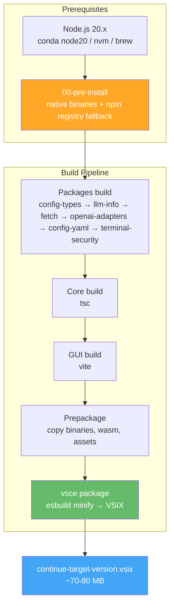
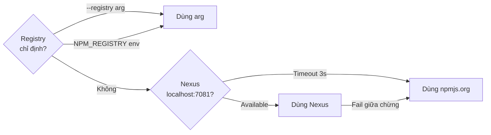
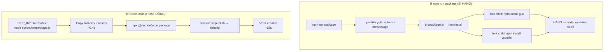
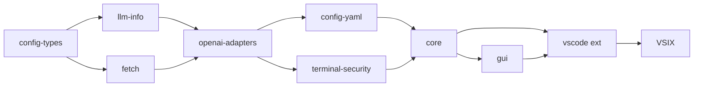

# 01 — Build Continue Extension

> Build VSIX từ source cho các platform: Linux/WSL, Windows, macOS.
> Output VSIX được dùng bởi `02-vscode-portable-windows` và `03-vscode-portable-linux-wsl`.

---

## Tổng quan flow build



---

## ⚠️ Node.js version — QUAN TRỌNG

Project yêu cầu **Node.js 20.x** (`.node-version` = `20.20.1`).

| Platform      | Quản lý Node                           | Command                              |
| ------------- | -------------------------------------- | ------------------------------------ |
| **Linux/WSL** | conda env `node20`                     | `conda run -n node20 node --version` |
| **Windows**   | Node.js cài trực tiếp hoặc nvm-windows | `node --version`                     |
| **macOS**     | conda env `node20` hoặc nvm/brew       | `conda run -n node20 node --version` |

> **Linux/WSL:** LUÔN dùng `conda run -n node20` — không dùng system Node.
> **macOS:** Ưu tiên conda env `node20`, fallback system Node nếu đúng version.
> Setup conda: `conda create -n node20 -y nodejs=20`

---

## Pre-install (native dependencies)

Script `00-pre-install` đảm bảo native binaries đúng platform có mặt trước khi build.
**Chạy lần đầu hoặc sau khi `package.json` thay đổi.**

### Registry auto-fallback



### Bash (Linux/WSL/macOS)

```bash
# Auto-detect registry (Nexus → fallback public)
bash deploy/01-build-extension/00-pre-install.sh --target linux-x64
bash deploy/01-build-extension/00-pre-install.sh --target darwin-arm64

# Force public registry (macOS khi không có Nexus)
bash deploy/01-build-extension/00-pre-install.sh --target darwin-arm64 --registry https://registry.npmjs.org/

# Check only (không install, chỉ verify)
bash deploy/01-build-extension/00-pre-install.sh --target darwin-arm64 --check-only
```

### PowerShell (Windows)

```powershell
# Auto-detect registry
.\deploy\01-build-extension\00-pre-install.ps1 -Target win32-x64

# Force public registry
.\deploy\01-build-extension\00-pre-install.ps1 -Target win32-x64 -Registry "https://registry.npmjs.org/"

# Check only
.\deploy\01-build-extension\00-pre-install.ps1 -Target win32-x64 -CheckOnly
```

### Khi nào cần chạy pre-install?

| Tình huống                                                          |         Cần?         |
| ------------------------------------------------------------------- | :------------------: |
| Lần đầu build trên máy                                              |          ✅          |
| Sau `git pull` có thay đổi package.json                             |          ✅          |
| `node_modules` install trên platform khác (vd: Windows → build WSL) |          ✅          |
| Đã build thành công, chỉ thay đổi code                              | ❌ dùng `--only-ext` |
| Sau `npm install` thủ công trên đúng platform                       |          ❌          |

---

## Build theo platform

### macOS

```bash
# Full build — auto-detect arch (~43-50s)
bash deploy/01-build-extension/build-macos.sh

# Force target
bash deploy/01-build-extension/build-macos.sh --target darwin-arm64

# Skip packages (đã build trước đó) — ~42s
bash deploy/01-build-extension/build-macos.sh --skip-packages

# Chỉ rebuild extension — ~12-14s
bash deploy/01-build-extension/build-macos.sh --only-ext
```

### Linux / WSL

```bash
# Full build linux-x64
bash deploy/01-build-extension/build-linux.sh --target linux-x64

# Cross-compile win32-x64 (xem điều kiện bên dưới)
bash deploy/01-build-extension/build-linux.sh --target win32-x64

# Skip packages
bash deploy/01-build-extension/build-linux.sh --target linux-x64 --skip-packages

# Chỉ rebuild extension
bash deploy/01-build-extension/build-linux.sh --target linux-x64 --only-ext
```

### Windows (PowerShell)

```powershell
# Full build win32-x64
.\deploy\01-build-extension\build-windows.ps1

# Custom target
.\deploy\01-build-extension\build-windows.ps1 -Target win32-x64

# Skip packages
.\deploy\01-build-extension\build-windows.ps1 -SkipPackages

# Chỉ rebuild extension
.\deploy\01-build-extension\build-windows.ps1 -OnlyExt
```

---

## Build options

| Option         | Bash                    | PowerShell             | Ý nghĩa                            |
| -------------- | ----------------------- | ---------------------- | ---------------------------------- |
| Target         | `--target darwin-arm64` | `-Target darwin-arm64` | Platform đích                      |
| Skip packages  | `--skip-packages`       | `-SkipPackages`        | Bỏ qua build 6 packages            |
| Only extension | `--only-ext`            | `-OnlyExt`             | Chỉ prepackage + vsce (nhanh nhất) |

---

## Build time tham chiếu

| Mode            | macOS arm64 | Linux/WSL x64 | Windows x64 |
| --------------- | :---------: | :-----------: | :---------: |
| Full build      |    ~50s     |    ~60-90s    |   ~60-90s   |
| --skip-packages |    ~42s     |     ~50s      |    ~50s     |
| --only-ext      |   ~12-14s   |    ~15-20s    |   ~15-20s   |

---

## Kiến trúc build (chi tiết kỹ thuật)

### Tại sao không dùng `npm run prepackage` / `npm run package`?

Các build scripts gọi **trực tiếp** `node scripts/prepackage.js` và `npx @vscode/vsce`
thay vì dùng npm scripts. Lý do:



| Vấn đề                            | Root cause                                                   | Fix                              |
| --------------------------------- | ------------------------------------------------------------ | -------------------------------- |
| `prepackage.js` hang              | `npmInstall()` fork child processes `npm install` → deadlock | `SKIP_INSTALLS=true`             |
| `npm run package` chạy prepackage | npm lifecycle convention `pre<script>`                       | Gọi `npx @vscode/vsce` trực tiếp |
| VSIX không tạo (exit 0)           | `package.js` không trigger `vscode:prepublish` (esbuild)     | `npx @vscode/vsce` trigger đúng  |

---

## Dependency chain (thứ tự build)



- `--skip-packages`: Bỏ qua build 6 packages (khi chưa thay đổi package code)
- `--only-ext`: Chỉ chạy prepackage + vsce (khi chỉ sửa extension/GUI code)

---

## Output

```
extensions/vscode/build/
└── continue-{target}-{version}.vsix    ← ~70-80 MB
```

| Target         | Dùng cho                    | Build host                      |
| -------------- | --------------------------- | ------------------------------- |
| `linux-x64`    | VSCode Linux / WSL portable | Linux/WSL ✅                    |
| `win32-x64`    | VSCode Windows              | Windows ✅, WSL ⚠️ (cần rg.exe) |
| `darwin-arm64` | macOS Apple Silicon         | macOS arm64 ✅                  |
| `darwin-x64`   | macOS Intel                 | macOS x64 ✅                    |

---

## Cross-compile từ WSL: build win32-x64

**Kết luận: CÓ THỂ, với một điều kiện:**

`@vscode/ripgrep` trong `extensions/vscode/node_modules/` phải có `rg.exe`
(Windows binary) — chỉ đúng nếu `npm install` đã chạy trên Windows trước đó.

```bash
# Kiểm tra trước khi cross-compile
ls extensions/vscode/node_modules/@vscode/ripgrep/bin/
# Có rg.exe → OK
# Chỉ có rg (Linux) → KHÔNG được, build trên Windows
```

---

## Install VSIX

```bash
# macOS / Linux
code --install-extension extensions/vscode/build/continue-darwin-arm64-2.1.1.vsix --force

# Windows
code --install-extension extensions\vscode\build\continue-win32-x64-2.1.1.vsix --force

# VSCode portable Linux (code-wsl)
code-wsl --install-extension extensions/vscode/build/continue-linux-x64-2.1.1.vsix --force
```

---

## Verify patches sau build

```bash
# Patch 01 — NIM empty response retry
grep -c "retry\|without.*tools" packages/openai-adapters/src/apis/OpenAI.ts  # >= 1

# Patch 02 — JSON sanitize
grep -c "sanitize\|JSON.parse"   core/llm/openaiTypeConverters.ts             # >= 1

# Patch 04 — Vision proxy
test -f core/llm/visionProxy.ts && echo "OK"                                  # OK

# Patch 08 — TLS self-signed
grep -c "rejectUnauthorized"      packages/fetch/src/getAgentOptions.ts       # >= 1
```

---

## Files trong folder này

| File                 | Mô tả                                                               |
| -------------------- | ------------------------------------------------------------------- |
| `00-pre-install.sh`  | Pre-install native deps — bash (Linux/WSL/macOS), registry fallback |
| `00-pre-install.ps1` | Pre-install native deps — PowerShell (Windows), registry fallback   |
| `build-linux.sh`     | Build script cho Linux/WSL (dùng conda node20)                      |
| `build-macos.sh`     | Build script cho macOS (conda hoặc system node, OneDrive detection) |
| `build-windows.ps1`  | Build script cho Windows (PowerShell)                               |
| `troubleshooting.md` | Xử lý lỗi thường gặp khi build                                      |
| `README.md`          | File này                                                            |

---

## Xem thêm

- [`troubleshooting.md`](./troubleshooting.md) — Lỗi thường gặp và cách xử lý
- [`../../.patches/README.md`](../../.patches/README.md) — Custom patches documentation
- [`../README.md`](../README.md) — Deploy workflow tổng quát
