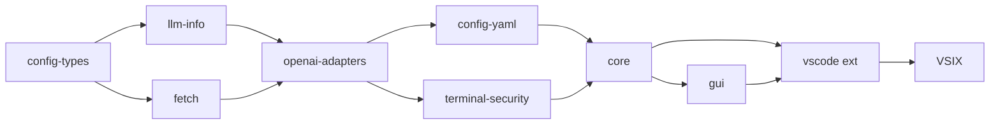

# 01 — Build Continue Extension

> Build VSIX từ source cho các platform: Linux/WSL, Windows, macOS.
> Output VSIX được dùng bởi `02-vscode-portable-windows` và `03-vscode-portable-linux-wsl`.

---

## ⚠️ Node.js version — QUAN TRỌNG

Project yêu cầu **Node.js 20.x** (`.node-version` = `20.20.1`).

| Platform | Quản lý Node | Command |
|---|---|---|
| **Linux/WSL** | conda env `node20` | `conda run -n node20 node --version` |
| **Windows** | Node.js cài trực tiếp hoặc nvm-windows | `node --version` |
| **macOS** | nvm hoặc Homebrew | `nvm use 20` |

> **Linux/WSL:** LUÔN dùng `conda run -n node20` — không dùng system Node.
> Xem setup conda: `conda create -n node20 -y nodejs=20`

---

## Build theo platform

### Linux / WSL (recommended)

```bash
cd /mnt/e/08-Sources/1.AI/continue

# Build linux-x64 (dùng cho VSCode Linux / WSL portable)
bash deploy/01-build-extension/build-linux.sh --target linux-x64

# Build win32-x64 từ WSL (cross-compile — xem note bên dưới)
bash deploy/01-build-extension/build-linux.sh --target win32-x64

# Chỉ rebuild extension (gui/core đã build rồi)
bash deploy/01-build-extension/build-linux.sh --target linux-x64 --only-ext
```

### Windows (PowerShell)

```powershell
cd E:\08-Sources\1.AI\continue

# Build win32-x64
.\deploy\01-build-extension\build-windows.ps1

# Chỉ rebuild extension
.\deploy\01-build-extension\build-windows.ps1 -Target win32-x64 -OnlyExt
```

### macOS

```bash
# Auto-detect arch (arm64 hoặc x64)
bash deploy/01-build-extension/build-macos.sh

# Force target
bash deploy/01-build-extension/build-macos.sh --target darwin-arm64
```

---

## Cross-compile từ WSL: build win32-x64

**Kết luận: CÓ THỂ, với một điều kiện:**

`@vscode/ripgrep` trong `extensions/vscode/node_modules/` phải có `rg.exe`
(Windows binary) — điều này chỉ đúng nếu `npm install` trong `extensions/vscode/`
đã chạy trên Windows trước đó (node_modules copy từ Windows sang WSL).

```bash
# Kiểm tra trước khi cross-compile
ls extensions/vscode/node_modules/@vscode/ripgrep/bin/
# Nếu có rg.exe → OK để cross-compile win32-x64
# Nếu chỉ có rg (Linux binary) → KHÔNG được, phải build trên Windows
```

**Khuyến nghị:** Cross-compile win32-x64 từ WSL chỉ dùng khi verify được ripgrep binary.

---

## Output

```
extensions/vscode/build/
└── continue-{target}-{version}.vsix    ← ~70-75 MB
```

| Target | Dùng cho | Build host |
|---|---|---|
| `linux-x64` | VSCode Linux / WSL portable | Linux/WSL ✅ |
| `win32-x64` | VSCode Windows | Windows ✅, WSL ⚠️ |
| `darwin-arm64` | macOS Apple Silicon | macOS arm64 ✅ |
| `darwin-x64` | macOS Intel | macOS x64 ✅ |

---

## Dependency chain (thứ tự build)



Dùng `--skip-packages` khi packages chưa thay đổi để tiết kiệm ~2 phút.
Dùng `--only-ext` khi chỉ thay đổi GUI/extension code.

---

## Verify patches sau build

```bash
grep -c "retry\|without.*tools" packages/openai-adapters/src/apis/OpenAI.ts  # >= 1
grep -c "sanitize\|JSON.parse"   core/llm/openaiTypeConverters.ts             # >= 1
test -f core/llm/visionProxy.ts && echo "OK"                                  # OK
grep -c "rejectUnauthorized"      packages/fetch/src/getAgentOptions.ts       # >= 1
```

Xem chi tiết: [`troubleshooting.md`](./troubleshooting.md)
