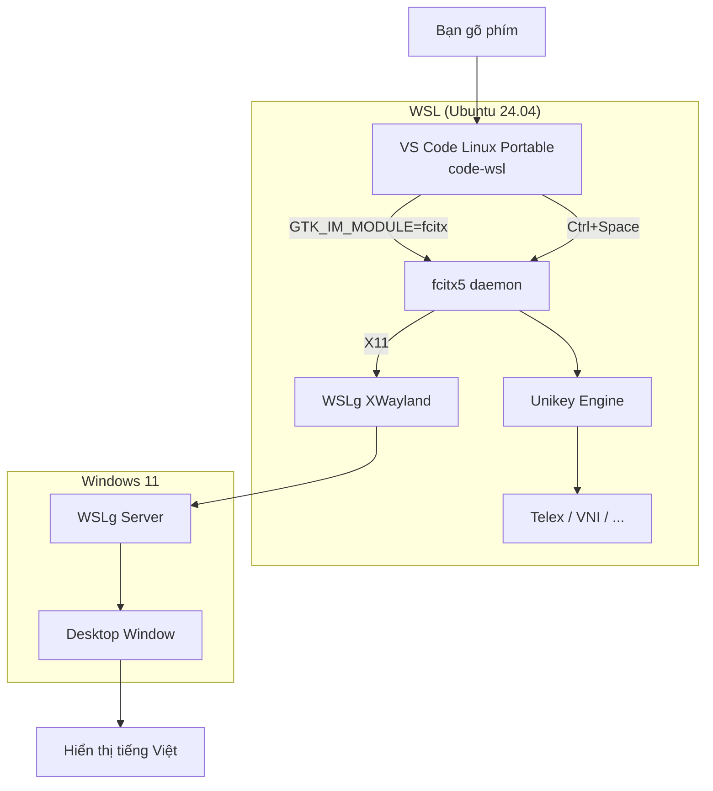

# Fcitx5 + Unikey: Gõ Tiếng Việt trong VS Code Native WSL (WSLg)

## Tổng quan

Tài liệu này mô tả cấu hình **fcitx5** với engine **Unikey** để gõ tiếng Việt trong 
**VS Code Linux Portable** chạy qua **WSLg** (Windows Subsystem for Linux GUI).

### Kiến trúc



### Nguyên tắc thiết kế

- **fcitx5 CHỈ active trong code-wsl** (WSLg app), không ảnh hưởng terminal WSL thông thường
- Environment variables được inject qua wrapper script `~/.local/bin/code-wsl`
- `~/.bashrc` **KHÔNG bị sửa** — tránh conflict hoàn toàn với môi trường terminal

---

## 1. Các thành phần đã cài đặt

### 1.1 Packages

| Package | Version | Mục đích |
|---------|---------|----------|
| `fcitx5` | 5.1.7 | Input method framework core |
| `fcitx5-unikey` | 5.1.2 | Engine gõ tiếng Việt (Unikey) |
| `fcitx5-config-qt` | 5.1.4 | GUI configuration tool |
| `fcitx5-data` | 5.1.7 | Common data files |
| `fcitx5-modules` | 5.1.7 | Core modules |
| `fcitx5-frontend-gtk3` | 5.1.1 | GTK3 IM module |
| `fcitx5-frontend-gtk4` | 5.1.1 | GTK4 IM module |
| `fcitx5-frontend-qt5` | 5.1.4 | Qt5 IM module |
| `fcitx5-frontend-qt6` | 5.1.4 | Qt6 IM module |

### 1.2 Files cấu hình

| File | Vai trò |
|------|---------|
| `~/.config/fcitx5/profile` | Input method profile (English + Unikey) |
| `~/.config/fcitx5/conf/unikey.conf` | Unikey engine config (Telex, Unicode) |
| `~/.local/bin/code-wsl` | VS Code wrapper (inject env + start fcitx5) |

---

## 2. File cấu hình chi tiết

### 2.1 `~/.config/fcitx5/profile`

```ini
[Groups/0]
Name=Default
Default Layout=us
DefaultIM=unikey

[Groups/0/Items/0]
Name=keyboard-us

[Groups/0/Items/1]
Name=unikey

[GroupOrder]
0=Default
```

- **DefaultIM=unikey**: Unikey là input method mặc định khi bật fcitx5
- **Items/0**: Keyboard US (tiếng Anh) — không gõ dấu
- **Items/1**: Unikey (tiếng Việt) — gõ dấu Telex/VNI
- **Chuyển đổi**: `Ctrl+Space` để toggle giữa 2 items

### 2.2 `~/.config/fcitx5/conf/unikey.conf`

```ini
[Input Method Engine Unikey]
InputMethod=Telex
OutputCharset=Unicode
SpellCheckEnabled=True
MacroEnabled=False
MouseSensitive=False
SkipNonVnChar=False
AutoRestoreNonVn=True
ModernStyle=True
FreeMarking=True
```

| Option | Giá trị | Ý nghĩa |
|--------|---------|---------|
| `InputMethod` | `Telex` | Kiểu gõ (Telex / VNI / SimpleTelex / VIQR) |
| `OutputCharset` | `Unicode` | Bảng mã đầu ra |
| `SpellCheckEnabled` | `True` | Kiểm tra chính tả tiếng Việt |
| `AutoRestoreNonVn` | `True` | Tự động tắt dấu khi gõ ký tự không phải tiếng Việt |
| `ModernStyle` | `True` | Style gõ mới (ưu tiên chữ cái có dấu sẵn) |
| `FreeMarking` | `True` | Cho phép đặt dấu tự do (không theo quy tắc cứng) |

### 2.3 `~/.local/bin/code-wsl` (fcitx5 block)

```bash
# === fcitx5 Vietnamese IME ===
# Chỉ active trong VSCode WSLg — KHÔNG ảnh hưởng terminal WSL
# Toggle: Ctrl+Space (EN↔VI), hoặc click icon trong system tray
export GTK_IM_MODULE=fcitx
export QT_IM_MODULE=fcitx
export XMODIFIERS=@im=fcitx

# Start fcitx5 daemon nếu chưa chạy
if ! pgrep -x fcitx5 > /dev/null 2>&1; then
  fcitx5 -d --replace > /tmp/fcitx5-wsl.log 2>&1 &
  FCITX5_PID=$!
  sleep 0.5  # Chờ daemon khởi động
fi
# === end fcitx5 ===
```

**Lưu ý quan trọng**: WSLg dùng XWayland, fcitx5 không có permission direct Wayland access.
Nếu gặp lỗi `zwp_input_method_v1@10: error 0: permission to bind input_method denied`,
cần thêm `--disable=wayland`:

```bash
export WAYLAND_DISPLAY=""
fcitx5 -d --replace --disable=wayland > /tmp/fcitx5-wsl.log 2>&1 &
```

---

## 3. Cách sử dụng

### 3.1 Khởi động

```bash
# Launch VS Code với project
code-wsl /path/to/project

# fcitx5 tự động start cùng VS Code
# Kiểm tra: nhìn system tray có icon bàn phím
```

### 3.2 Chuyển đổi ngôn ngữ

| Thao tác | Kết quả |
|----------|---------|
| `Ctrl + Space` | Toggle English ↔ Vietnamese |
| Click icon fcitx5 trong system tray | Chọn input method |
| Right-click icon → Configure | Mở GUI config |

### 3.3 Gõ tiếng Việt (Telex)

Telex là kiểu gõ mặc định, giống Unikey trên Windows:

| Gõ | Kết quả |
|----|---------|
| `aw` | ă |
| `aa` | â |
| `dd` | đ |
| `ee` | ê |
| `oo` | ô |
| `ow` | ơ |
| `uw` | ư |

| Dấu | Gõ | Ví dụ |
|-----|----|-------|
| Sắc | `s` | `as` → á |
| Huyền | `f` | `af` → à |
| Hỏi | `r` | `ar` → ả |
| Ngã | `x` | `ax` → ã |
| Nặng | `j` | `aj` → ạ |

**Ví dụ**: Gõ "vie65t nam" → "việt nam"

### 3.4 Đổi sang VNI

Nếu bạn quen gõ VNI, sửa file `~/.config/fcitx5/conf/unikey.conf`:

```bash
sed -i 's/InputMethod=Telex/InputMethod=VNI/' ~/.config/fcitx5/conf/unikey.conf

# Restart fcitx5
pkill fcitx5
# Mở lại code-wsl, fcitx5 sẽ tự start lại
```

VNI:
| Gõ | Kết quả |
|----|---------|
| `a1` | á |
| `a2` | à |
| `a3` | ả |
| `a4` | ã |
| `a5` | ạ |
| `a6` | â |
| `a8` | ă |
| `a9` | ơ |
| `a0` | ờ |

---

## 4. Troubleshooting

### 4.1 fcitx5 không start

```bash
# Kiểm tra process
ps aux | grep fcitx5

# Xem log
cat /tmp/fcitx5-wsl.log

# Start thủ công để debug
export WAYLAND_DISPLAY=""
fcitx5 -d --replace --disable=wayland
```

### 4.2 Lỗi Wayland permission denied

**Lỗi**:
```
zwp_input_method_v1@10: error 0: permission to bind input_method denied
```

**Nguyên nhân**: WSLg dùng XWayland, fcitx5 không có permission direct Wayland access.

**Fix**: Sửa `~/.local/bin/code-wsl`:
```bash
# Thay dòng start fcitx5 bằng:
export WAYLAND_DISPLAY=""
fcitx5 -d --replace --disable=wayland > /tmp/fcitx5-wsl.log 2>&1 &
```

### 4.3 VS Code không nhận fcitx5

Kiểm tra environment variables trong VS Code terminal (`Ctrl+``):

```bash
echo $GTK_IM_MODULE   # Phải là "fcitx"
echo $QT_IM_MODULE    # Phải là "fcitx"
echo $XMODIFIERS      # Phải là "@im=fcitx"
```

Nếu chưa đúng, kiểm tra lại block fcitx5 trong `~/.local/bin/code-wsl`.

### 4.4 Gõ tiếng Việt ra chữ "telex" thay vì dấu

**Nguyên nhân**: Unikey chưa được kích hoạt, đang ở keyboard-us.

**Fix**: Nhấn `Ctrl+Space` để chuyển sang Unikey.

### 4.5 Gõ tiếng Việt ra ký tự lạ (UTF-8 sai)

**Nguyên nhân**: OutputCharset không phải Unicode.

**Fix**:
```bash
sed -i 's/OutputCharset=.*/OutputCharset=Unicode/' ~/.config/fcitx5/conf/unikey.conf
pkill fcitx5
# Mở lại code-wsl
```

### 4.6 fcitx5 icon không hiện trong system tray

WSLg không hỗ trợ system tray đầy đủ. Bạn vẫn có thể:
- Dùng `Ctrl+Space` để toggle (không cần icon)
- Dùng `fcitx5-configtool` để cấu hình (mở từ terminal)

---

## 5. So sánh các phương án

| Phương án | Ưu điểm | Nhược điểm |
|-----------|---------|------------|
| **fcitx5 + Unikey** ✅ | Native trong WSL, không phụ thuộc Windows, nhiều kiểu gõ | Cần cấu hình, WSLg Wayland issue |
| **IBus** (mặc định Ubuntu) | Có sẵn, dễ cài | Chậm hơn fcitx5, ít tùy biến |
| **Windows IME** | Không cần cài đặt | Chỉ gõ được ở Windows apps, không ảnh hưởng WSL |
| **EVKey (Windows)** | Quen thuộc với người dùng Unikey | Phải chuyển cửa sổ, không tích hợp WSL |

---

## 6. Uninstall

```bash
# Gỡ fcitx5 khỏi code-wsl wrapper
bash 04-setup-fcitx5-vietnamese.sh --uninstall

# Gỡ packages (nếu muốn)
sudo apt remove fcitx5 fcitx5-unikey fcitx5-config-qt

# Xóa config
rm -rf ~/.config/fcitx5
```

---

## 7. Tham khảo

- Script setup: `04-setup-fcitx5-vietnamese.sh`
- VS Code wrapper: `~/.local/bin/code-wsl`
- Log file: `/tmp/fcitx5-wsl.log`
- Fcitx5 docs: https://fcitx-im.org/
- Unikey engine: https://github.com/fcitx/fcitx5-unikey
