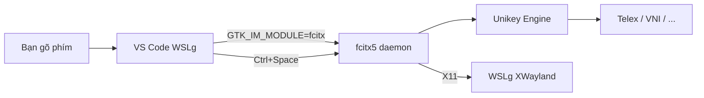

# Fcitx5 + Unikey: Gõ Tiếng Việt trong VS Code Native WSL (WSLg)

## Tổng quan

Cấu hình **fcitx5** với engine **Unikey** để gõ tiếng Việt trong **VS Code Linux Portable** chạy qua **WSLg** (code-wsl).

## Kiến trúc



## Các thành phần đã cài đặt

| Package | Version | Mục đích |
|---------|---------|----------|
| `fcitx5` | 5.1.7 | Input method framework |
| `fcitx5-unikey` | 5.1.2 | Engine gõ tiếng Việt (Unikey) |
| `fcitx5-config-qt` | 5.1.4 | GUI config tool |
| `fcitx5-frontend-gtk3/gtk4` | - | GTK IM modules |
| `fcitx5-frontend-qt5/qt6` | - | Qt IM modules |

## File cấu hình

### 1. `~/.config/fcitx5/profile` - Input method profile

```
[Groups/0]
Name=Default
Default Layout=us
DefaultIM=unikey

[Groups/0/Items/0]
Name=keyboard-us
Layout=

[Groups/0/Items/1]
Name=unikey
Layout=

[GroupOrder]
0=Default
```

- **DefaultIM=unikey**: Unikey là input method mặc định
- **Items/0**: Keyboard US (tiếng Anh)
- **Items/1**: Unikey (tiếng Việt)

### 2. `~/.config/fcitx5/conf/unikey.conf` - Unikey engine config

```
[Input Method Engine Unikey]
InputMethod=Telex
OutputCharset=Unicode
SpellCheckEnabled=True
MacroEnabled=False
MouseSensitive=False
SkipNonVnChar=False
AutoRestoreNonVn=True
ModernStyle=True
FreeMarking=True
```

- **InputMethod**: `Telex` (có thể đổi thành `VNI`, `SimpleTelex`, `VIQR`)
- **OutputCharset**: `Unicode`

### 3. `~/.local/bin/code-wsl` - VS Code wrapper (đã patch)

Script wrapper tự động:
- Set `GTK_IM_MODULE`, `QT_IM_MODULE`, `XMODIFIERS`
- Start fcitx5 daemon với `--disable=wayland` (quan trọng cho WSLg)
- Launch VS Code Linux Portable

## Cách sử dụng

### Chuyển đổi ngôn ngữ

| Phím tắt | Hành động |
|-----------|-----------|
| `Ctrl + Space` | Chuyển giữa English ↔ Vietnamese |
| Click icon system tray | Chọn input method |

### Gõ tiếng Việt

Unikey hỗ trợ các kiểu gõ:
- **Telex**: `aw` → ă, `aa` → â, `dd` → đ, `s` → sắc, `f` → huyền, ...
- **VNI**: `a1` → á, `a2` → à, `a3` → ả, ...
- Có thể đổi trong `~/.config/fcitx5/conf/unikey.conf`

## Troubleshooting

### fcitx5 không start

```bash
# Kiểm tra process
ps aux | grep fcitx5

# Xem log
cat /tmp/fcitx5-wsl.log

# Start thủ công
export WAYLAND_DISPLAY=""
fcitx5 -d --replace --disable=wayland
```

### Lỗi Wayland permission denied

```
zwp_input_method_v1@10: error 0: permission to bind input_method denied
```

**Nguyên nhân**: WSLg dùng XWayland, fcitx5 không có permission direct Wayland access.

**Fix**: Luôn dùng `--disable=wayland` flag.

### VS Code không nhận fcitx5

Kiểm tra environment variables trong VS Code terminal:
```bash
echo $GTK_IM_MODULE  # phải là "fcitx"
echo $QT_IM_MODULE   # phải là "fcitx"
echo $XMODIFIERS     # phải là "@im=fcitx"
```

### Muốn đổi kiểu gõ (Telex → VNI)

```bash
# Sửa file config
sed -i 's/InputMethod=Telex/InputMethod=VNI/' ~/.config/fcitx5/conf/unikey.conf

# Restart fcitx5
pkill fcitx5
export WAYLAND_DISPLAY=""
fcitx5 -d --disable=wayland
```

## So sánh: Các phương án gõ tiếng Việt trong WSL

| Phương án | Ưu điểm | Nhược điểm |
|-----------|---------|------------|
| **fcitx5 + Unikey** ✅ | Chạy native trong WSL, không phụ thuộc Windows | Cần cấu hình, WSLg Wayland issue |
| IBus | Mặc định trên Ubuntu | Chậm hơn fcitx5, ít tùy biến |
| Windows IME (gõ từ Windows) | Không cần cài đặt | Chỉ gõ được ở Windows apps |
| EVKey (Windows) | Quen thuộc | Không ảnh hưởng WSL apps |
