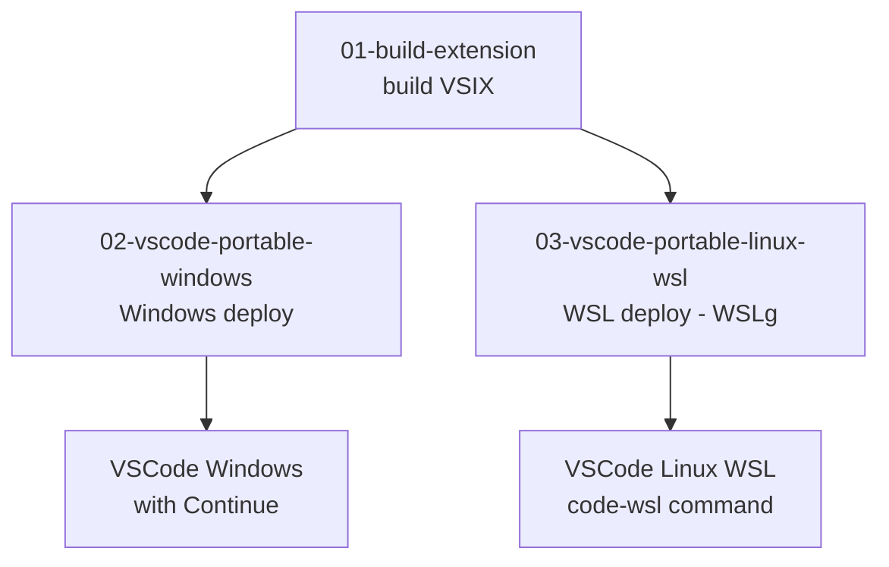

# Deploy — Continue Extension On-Prem

> Feature-based structure: mỗi folder là một squad tự chứa đủ scripts + docs.

---

## Structure

```
deploy/
├── 01-build-extension/          Build VSIX từ source (Linux/WSL, Windows, macOS)
├── 02-vscode-portable-windows/  VSCode portable air-gap cho Windows
└── 03-vscode-portable-linux-wsl/ VSCode portable air-gap cho Linux/WSL (WSLg)
```

---

## Workflow tổng quát



---

## Quickstart theo use case

### Build VSIX

```bash
# Linux/WSL → linux-x64
bash deploy/01-build-extension/build-linux.sh --target linux-x64

# Linux/WSL → win32-x64 (nếu node_modules/ripgrep đã có rg.exe)
bash deploy/01-build-extension/build-linux.sh --target win32-x64

# Windows → win32-x64
.\deploy\01-build-extension\build-windows.ps1

# macOS → darwin-arm64
bash deploy/01-build-extension/build-macos.sh
```

### Setup VSCode portable Windows (air-gap)

```powershell
cd deploy\02-vscode-portable-windows
.\download-vscode.ps1      # 1 lần, máy có internet
.\setup-portable.ps1
.\install-continue.ps1
.\verify.ps1
```

### Setup VSCode portable Linux/WSL (WSLg, fix tool call terminal)

```bash
bash deploy/03-vscode-portable-linux-wsl/01-setup-vscode-portable.sh
bash deploy/01-build-extension/build-linux.sh --target linux-x64
bash deploy/03-vscode-portable-linux-wsl/02-install-continue.sh
bash deploy/03-vscode-portable-linux-wsl/03-verify.sh
source ~/.bashrc && code-wsl .
```

---

## VSCode version

| Property | Value |
|----------|-------|
| Version | `1.132.0` |
| Commit | `df53daabb1` |
| Date | `2026-08-04` |
| Custom extension | `2.1.1` (branch `release/v2.1.x-onprem`) |

---

## Notes

- Binaries (`*.tar.gz`, `*.zip`, `*.vsix`) được gitignore — không commit lên repo
- VSIX build output tại: `extensions/vscode/build/continue-{target}-{version}.vsix`
- Patches documentation: xem `.patches/README.md`
