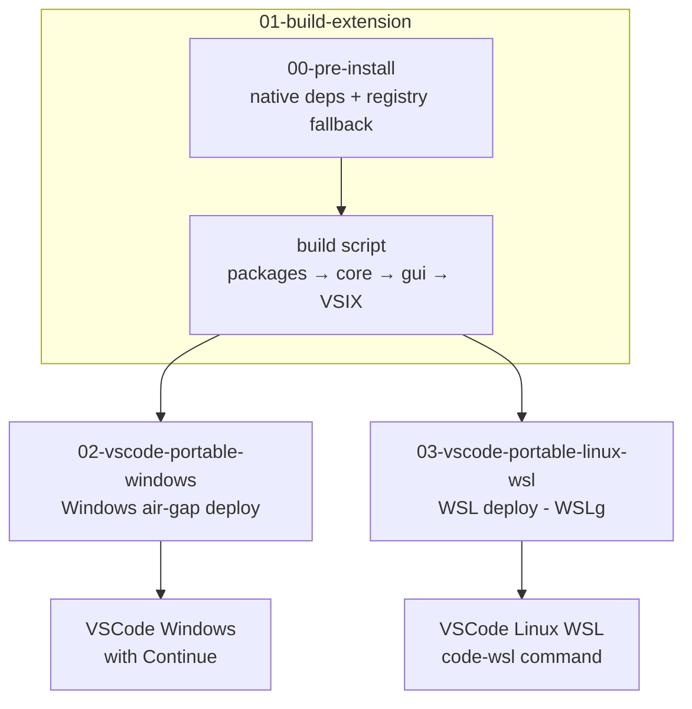
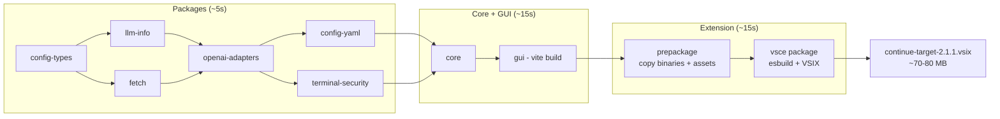
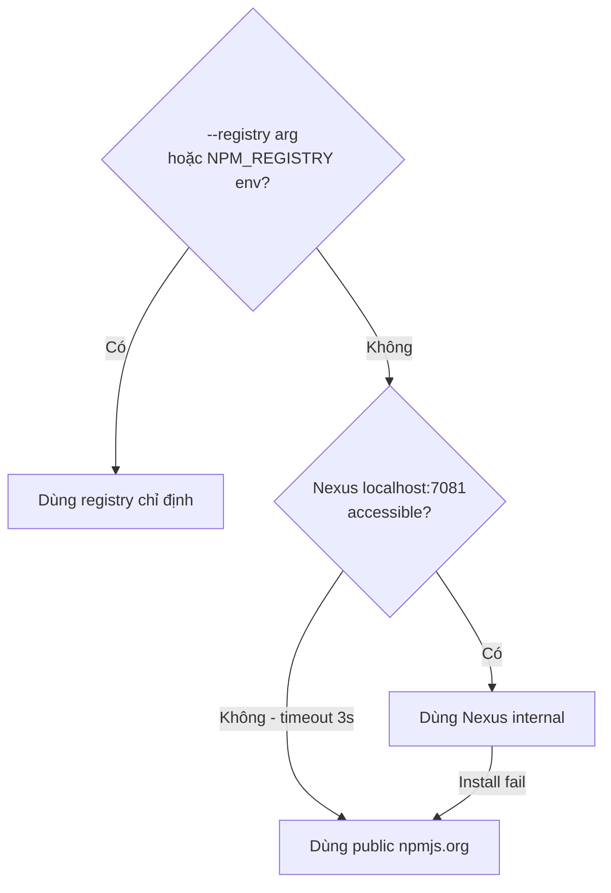

# Deploy — Continue Extension On-Prem

> Feature-based structure: mỗi folder là một squad tự chứa đủ scripts + docs.

---

## Structure

```
deploy/
├── 01-build-extension/           Build VSIX từ source (Linux/WSL, Windows, macOS)
│   ├── 00-pre-install.sh         Pre-install native deps (bash, registry fallback)
│   ├── 00-pre-install.ps1        Pre-install native deps (PowerShell, registry fallback)
│   ├── build-linux.sh            Build trên Linux/WSL (conda node20)
│   ├── build-macos.sh            Build trên macOS (conda hoặc system node)
│   ├── build-windows.ps1         Build trên Windows (PowerShell)
│   ├── README.md                 Hướng dẫn chi tiết
│   └── troubleshooting.md        Xử lý lỗi thường gặp
├── 02-vscode-portable-windows/   VSCode portable air-gap cho Windows
└── 03-vscode-portable-linux-wsl/ VSCode portable air-gap cho Linux/WSL (WSLg)
```

---

## Workflow tổng quát



---

## Build pipeline (tất cả platforms)



---

## Quickstart theo platform

### macOS (Apple Silicon / Intel)

```bash
# Pre-install (lần đầu hoặc sau git pull thay đổi deps)
bash deploy/01-build-extension/00-pre-install.sh --target darwin-arm64

# Full build (~43s)
bash deploy/01-build-extension/build-macos.sh

# Quick rebuild khi chỉ sửa extension/GUI code (~12s)
bash deploy/01-build-extension/build-macos.sh --only-ext

# Output: extensions/vscode/build/continue-darwin-arm64-2.1.1.vsix
```

### Linux / WSL

```bash
# Pre-install (fix platform binaries, auto-detect Nexus/public registry)
bash deploy/01-build-extension/00-pre-install.sh --target linux-x64

# Full build
bash deploy/01-build-extension/build-linux.sh --target linux-x64

# Quick rebuild
bash deploy/01-build-extension/build-linux.sh --target linux-x64 --only-ext

# Cross-compile win32-x64 (cần rg.exe từ Windows npm install trước đó)
bash deploy/01-build-extension/build-linux.sh --target win32-x64
```

### Windows (PowerShell)

```powershell
# Pre-install (auto-detect Nexus/public registry)
.\deploy\01-build-extension\00-pre-install.ps1

# Full build
.\deploy\01-build-extension\build-windows.ps1

# Quick rebuild
.\deploy\01-build-extension\build-windows.ps1 -OnlyExt
```

---

## npm Registry — Auto Fallback

Build scripts và pre-install tự động detect npm registry:



| Env                  | Nexus | Registry sử dụng                              |
| -------------------- | :---: | --------------------------------------------- |
| Linux/WSL (có Nexus) |  ✅   | `http://localhost:7081/repository/npm-group/` |
| macOS local dev      |  ❌   | `https://registry.npmjs.org/` (auto fallback) |
| Windows (có Nexus)   |  ✅   | `http://localhost:7081/repository/npm-group/` |
| CI/CD                |   —   | Override qua `--registry` hoặc env var        |

---

## Setup VSCode portable Windows (air-gap)

```powershell
cd deploy\02-vscode-portable-windows
.\download-vscode.ps1      # 1 lần, máy có internet
.\setup-portable.ps1
.\install-continue.ps1
.\verify.ps1
```

## Setup VSCode portable Linux/WSL (WSLg)

```bash
bash deploy/03-vscode-portable-linux-wsl/01-setup-vscode-portable.sh
bash deploy/01-build-extension/build-linux.sh --target linux-x64
bash deploy/03-vscode-portable-linux-wsl/02-install-continue.sh
bash deploy/03-vscode-portable-linux-wsl/03-verify.sh
source ~/.bashrc && code-wsl .
```

---

## Build time tham chiếu

| Platform      | Full build | --skip-packages | --only-ext |
| ------------- | :--------: | :-------------: | :--------: |
| macOS arm64   |    ~50s    |      ~42s       |  ~12-14s   |
| Linux/WSL x64 |  ~60-90s   |      ~50s       |  ~15-20s   |
| Windows x64   |  ~60-90s   |      ~50s       |  ~15-20s   |

---

## VSCode version

| Property         | Value                                    |
| ---------------- | ---------------------------------------- |
| Version          | `1.132.0`                                |
| Commit           | `df53daabb1`                             |
| Date             | `2026-08-04`                             |
| Custom extension | `2.1.1` (branch `release/v2.1.x-onprem`) |

---

## Notes

- Binaries (`*.tar.gz`, `*.zip`, `*.vsix`) được gitignore — không commit lên repo
- VSIX build output tại: `extensions/vscode/build/continue-{target}-{version}.vsix`
- Patches documentation: xem `.patches/README.md`
- Troubleshooting: xem `deploy/01-build-extension/troubleshooting.md`
