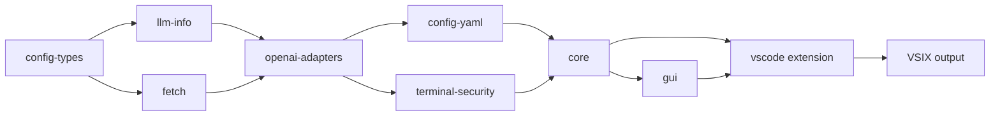

# Build Continue VSCode Extension — Hướng dẫn đầy đủ

> **Cập nhật:** 2026-08-09
> **Repo:** `E:\08-Sources\1.AI\continue` (Windows) / `/mnt/e/08-Sources/1.AI/continue` (WSL)
> **Version hiện tại:** `2.1.1` (branch `develop` / `release/v2.1.x-onprem`)

---

## ⚠️ Yêu cầu quan trọng — Node.js version

Project yêu cầu **Node.js 20.x** (`.node-version` file ghi `20.20.1`).

### Quản lý Node.js bằng Miniconda (recommended — đã setup sẵn)

Môi trường build chuẩn dùng **conda env `node20`** được quản lý bởi Miniconda:

```bash
# Kiểm tra env đã có chưa
conda env list | grep node20

# Tạo mới nếu chưa có
conda create -n node20 -y nodejs=20

# Verify
conda run -n node20 node --version   # v20.17.0
conda run -n node20 npm --version    # 10.8.2
```

**Luôn dùng `conda run -n node20` để chạy npm/node commands** — KHÔNG dùng system Node.js
vì có thể khác version, gây lỗi native module mismatch.

```bash
# ĐÚNG — chạy qua conda env
conda run -n node20 npm install
conda run -n node20 npm run build

# SAI — dùng system Node.js (version có thể khác)
npm install
npm run build
```

---

## Mục lục

1. [Môi trường build](#1-môi-trường-build)
2. [Chuẩn bị repo](#2-chuẩn-bị-repo)
3. [Cấu trúc thư mục](#3-cấu-trúc-thư-mục)
4. [Build — WSL/Linux (recommended)](#4-build--wsllinux-recommended)
5. [Build — Windows PowerShell](#5-build--windows-powershell)
6. [Build targets và platform notes](#6-build-targets-và-platform-notes)
7. [Install extension](#7-install-extension)
8. [Verify kết quả](#8-verify-kết-quả)
9. [Các patches đã áp dụng](#9-các-patches-đã-áp-dụng)

---

## 1. Môi trường build

### Conda env `node20` (WSL/Linux)

| Component | Version | Quản lý |
|-----------|---------|---------|
| Node.js | v20.17.0 | conda env `node20` |
| npm | 10.8.2 | conda env `node20` |
| conda | latest | Miniconda |
| git | system | apt |

```bash
# Kiểm tra đầy đủ
conda run -n node20 node --version   # v20.17.0
conda run -n node20 npm --version    # 10.8.2
git --version
```

### Windows PowerShell

Nếu build trên Windows (cho target `win32-x64`), cần Node.js 20.x được cài trực tiếp.
Khuyến nghị dùng **nvm-windows** hoặc tải trực tiếp từ nodejs.org.

```powershell
node --version    # phải là v20.x.x
npm --version     # phải là 10.x
```

> **Lưu ý:** Trên Windows không có conda env `node20`. Dùng Node.js được cài trực tiếp.
> Cần đảm bảo version đúng trước khi build.

---

## 2. Chuẩn bị repo

```bash
# Repo location
cd /mnt/e/08-Sources/1.AI/continue  # WSL
# hoặc E:\08-Sources\1.AI\continue  # Windows

# Đảm bảo đang ở đúng branch
git branch          # phải là develop hoặc release/v2.1.x-onprem
git log --oneline -3

# Kiểm tra patches còn nguyên
grep -c "retry\|without.*tools" packages/openai-adapters/src/apis/OpenAI.ts
# Expected: >= 1

test -f core/llm/visionProxy.ts && echo "vision proxy OK" || echo "MISSING"
grep -c "rejectUnauthorized\|verifySsl" packages/fetch/src/getAgentOptions.ts
# Expected: >= 1
```

---

## 3. Cấu trúc thư mục

```
continue/
├── .patches/                      # Custom patch docs (01-08)
├── deploy/
│   ├── README.md                  # Air-gap deployment guide
│   ├── docs/
│   │   ├── 01-build-guide.md      # File này
│   │   └── 02-build-troubleshooting.md
│   ├── package-deploy.ps1         # Main deploy script
│   └── scripts/                   # Deploy helper scripts
├── scripts/
│   └── build-all.ps1              # Build tự động (Windows)
├── packages/
│   ├── config-types/              # [1] Build đầu tiên
│   ├── llm-info/                  # [2]
│   ├── fetch/                     # [3]
│   ├── openai-adapters/           # [4]
│   ├── config-yaml/               # [5]
│   └── terminal-security/         # [6]
├── core/                          # [7]
├── gui/                           # [8]
└── extensions/vscode/             # [9] → VSIX output
    └── build/continue-{target}-{version}.vsix
```

### Thứ tự build (dependency chain)



---

## 4. Build — WSL/Linux (recommended)

Build từ WSL là cách ưu tiên vì conda env `node20` đã được setup sẵn.

### 4.1. Build nhanh (single command)

```bash
cd /mnt/e/08-Sources/1.AI/continue
git checkout release/v2.1.x-onprem  # hoặc develop

conda run -n node20 bash -c '
  set -e
  cd packages/openai-adapters && npm run build && cd ../.. &&
  cd core && npm run build && cd .. &&
  cd gui && npm run build && cd .. &&
  cd extensions/vscode &&
    npm run prepackage -- --target linux-x64 &&
    npm run package -- --target linux-x64
'

ls -lh extensions/vscode/build/*.vsix
```

### 4.2. Build từng bước (khi cần debug)

```bash
cd /mnt/e/08-Sources/1.AI/continue

# Bước 1-6: Build packages (chỉ cần nếu packages có thay đổi)
for pkg in config-types llm-info fetch openai-adapters config-yaml terminal-security; do
  echo "=== Building $pkg ==="
  conda run -n node20 bash -c "cd packages/$pkg && npm run build 2>&1 | tail -3"
done

# Bước 7: Core
echo "=== Building core ==="
conda run -n node20 bash -c "cd core && npm run build 2>&1 | tail -5"

# Bước 8: GUI
echo "=== Building gui ==="
conda run -n node20 bash -c "cd gui && npm run build 2>&1 | tail -5"

# Bước 9: VSCode extension
echo "=== Packaging extension ==="
conda run -n node20 bash -c "
  cd extensions/vscode &&
  npm run prepackage -- --target linux-x64 &&
  npm run package -- --target linux-x64
"

# Kết quả
ls -lh extensions/vscode/build/*.vsix
```

### 4.3. Chỉ rebuild extension (khi chỉ thay đổi GUI/core, không phải packages)

```bash
cd /mnt/e/08-Sources/1.AI/continue

conda run -n node20 bash -c '
  cd core && npm run build && cd .. &&
  cd gui && npm run build && cd .. &&
  cd extensions/vscode &&
    npm run prepackage -- --target linux-x64 &&
    npm run package -- --target linux-x64
'
```

---

## 5. Build — Windows PowerShell

> **⚠️ Yêu cầu:** Node.js 20.x phải được cài trực tiếp trên Windows (không qua conda).
> Kiểm tra `node --version` trước khi build.

### 5.1. Build tự động

```powershell
cd E:\08-Sources\1.AI\continue
.\scripts\build-all.ps1
# hoặc: .\scripts\build-all.ps1 -Target win32-x64
```

### 5.2. Build thủ công

```powershell
$root = "E:\08-Sources\1.AI\continue"

# Packages
foreach ($pkg in @("config-types","llm-info","fetch","openai-adapters","config-yaml","terminal-security")) {
    cd "$root\packages\$pkg"
    npm install; npm run build
}

# Core
cd "$root\core"; npm install; npm run build

# GUI
cd "$root\gui"; npm install; npm run build

# Extension
cd "$root\extensions\vscode"
npm install
npm run prepackage -- --target win32-x64
npm run package -- --target win32-x64
```

### 5.3. Thời gian ước tính

| Step | Package | Thời gian |
|:----:|---------|:---------:|
| 1-6 | packages | ~2 phút |
| 7 | core | ~30s |
| 8 | gui | ~60s |
| 9 | vscode extension | ~2 phút |
| | **Tổng** | **~5-6 phút** |

---

## 6. Build targets và platform notes

> **⚠️ QUAN TRỌNG: Build phải chạy trên đúng target OS!**
> Native modules (`onnxruntime-node`, `@lancedb/vectordb`, `@vscode/ripgrep`) được copy
> trực tiếp từ `node_modules` của host — không thể cross-compile.

| Build host | Target flag | Output VSIX | Dùng cho |
|---|---|---|---|
| WSL/Linux x64 | `linux-x64` | `continue-linux-x64-2.1.1.vsix` | Linux users |
| Windows x64 | `win32-x64` | `continue-win32-x64-2.1.1.vsix` | Windows users |
| macOS arm64 | `darwin-arm64` | `continue-darwin-arm64-2.1.1.vsix` | Mac M-series |
| macOS x64 | `darwin-x64` | `continue-darwin-x64-2.1.1.vsix` | Mac Intel |

```bash
# Build cho từng platform — chạy trên đúng OS tương ứng
npm run prepackage -- --target linux-x64    # trên Linux/WSL
npm run prepackage -- --target win32-x64    # trên Windows
npm run prepackage -- --target darwin-arm64 # trên macOS Apple Silicon
```

---

## 7. Install extension

### WSL/Linux

```bash
code --install-extension extensions/vscode/build/continue-linux-x64-2.1.1.vsix --force
```

### Windows

```powershell
code --install-extension extensions\vscode\build\continue-win32-x64-2.1.1.vsix --force
```

### VSCode UI (cross-platform)

1. `Ctrl+Shift+X` → Extensions panel
2. Click `...` → `Install from VSIX...`
3. Chọn file `.vsix` tương ứng platform

### Verify sau install

```bash
code --list-extensions | grep continue
# Expected: Continue.continue
```

---

## 8. Verify kết quả

### VSIX file

```bash
# WSL
ls -lh extensions/vscode/build/*.vsix
# Expected: ~70-75 MB, ngày hôm nay
```

### Patches còn nguyên

```bash
# Patch 1 — NIM empty response retry
grep -c "retry\|without.*tools" packages/openai-adapters/src/apis/OpenAI.ts
# Expected: >= 1

# Patch 2 — JSON sanitize
grep -c "sanitize\|JSON.parse" core/llm/openaiTypeConverters.ts
# Expected: >= 1

# Patch 3 — Vision proxy
test -f core/llm/visionProxy.ts && echo "OK" || echo "MISSING"

# Patch 4 — TLS
grep -c "rejectUnauthorized\|verifySsl" packages/fetch/src/getAgentOptions.ts
# Expected: >= 1
```

### Extension hoạt động

1. Reload VSCode: `Ctrl+Shift+P` → `Developer: Reload Window`
2. `Ctrl+Shift+P` → `Continue: Open config file` — config load được
3. Chat thử với model — response không bị blank

---

## 9. Các patches đã áp dụng

| # | Patch doc | File thay đổi | Mô tả |
|:-:|-----------|--------------|-------|
| 1 | `01-nim-empty-response-retry.md` | `packages/openai-adapters/src/apis/OpenAI.ts` | Retry without tools khi NIM/vLLM trả `content:null` + `tool_calls:[]` |
| 2 | `02-tool-arguments-json-sanitize.md` | `core/llm/openaiTypeConverters.ts` | Sanitize malformed JSON tool args |
| 3 | `04-vision-proxy.md` | `core/llm/visionProxy.ts` | Vision proxy cho text-only LLMs |
| 4 | `08-tls-self-signed-fix.md` | `packages/fetch/src/getAgentOptions.ts` | Default `rejectUnauthorized: false` cho on-prem |
| 5 | — | `gui/src/components/mainInput/ContextStatus.tsx` | Always-on context usage display |

Chi tiết: [`.patches/README.md`](../../.patches/README.md)

---

## Appendix — So sánh build platforms

| Hạng mục | WSL/Linux x64 | Windows x64 | macOS arm64 |
|----------|:------------:|:-----------:|:-----------:|
| Target | `linux-x64` | `win32-x64` | `darwin-arm64` |
| Node version | conda `node20` | node trực tiếp | nvm/node |
| Thời gian build | ~5-6 phút | ~5-8 phút | ~5-8 phút |
| VSIX size | ~70 MB | ~71 MB | ~70 MB |
| Cross-compile | ❌ | ❌ | ❌ |
