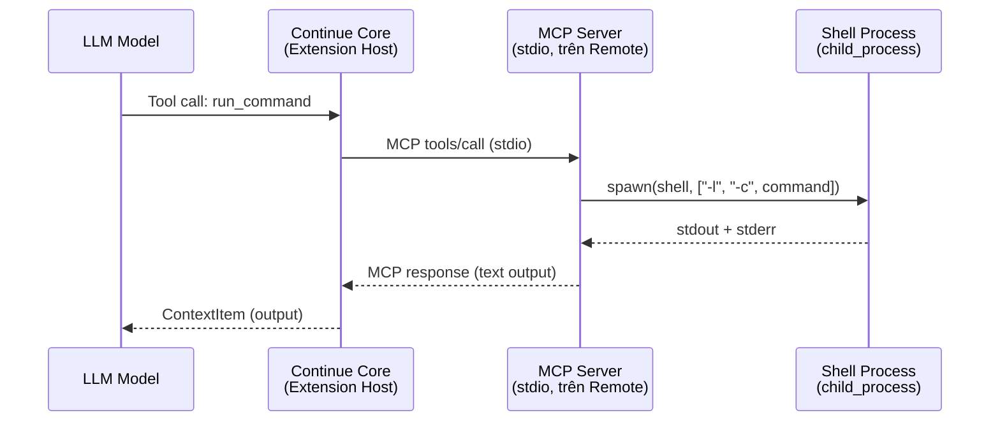
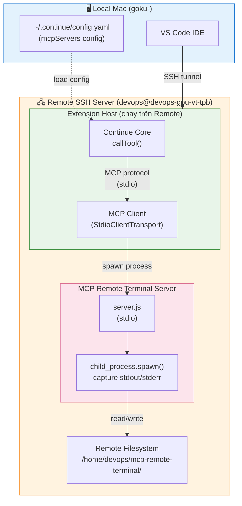
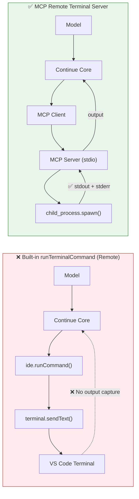

# MCP Remote Terminal Server

MCP server giải quyết hạn chế của Continue extension khi làm việc trên **Remote SSH** — built-in `runTerminalCommand` tool không capture được output.

## Vấn đề

Khi Connect VS Code đến remote SSH server, Continue's `runTerminalCommand` tool:
- Chạy lệnh trên remote ✅
- **Không capture output** ❌ (VS Code API `terminal.sendText()` không hỗ trợ)

```
Command executed in remote terminal. Output capture is not yet available for remote environments.
```

## Giải pháp

MCP server này chạy **trên remote** (vì `extensionKind: ["ui", "workspace"]` → extension host chạy trên remote). Nó dùng `child_process.spawn()` trực tiếp để capture stdout/stderr.



## Cài đặt

### 1. Copy folder lên remote server

```bash
# Trên local Mac:
scp -r mcp-remote-terminal/ devops@your-remote-server:~/mcp-remote-terminal/

# Hoặc nếu remote có git:
# Push lên git rồi pull trên remote
```

### 2. Install dependencies trên remote

```bash
ssh devops@your-remote-server
cd ~/mcp-remote-terminal
npm install
```

> **Lưu ý**: Nếu remote không có internet, copy `node_modules` từ local hoặc dùng fallback path (server.js đã có fallback đến `../core/node_modules/`).

### 3. Config trong Continue

Thêm vào `~/.continue/config.yaml` (trên **local Mac**):

```yaml
mcpServers:
  - name: remote-terminal
    command: node
    args:
      - /home/devops/mcp-remote-terminal/server.js
```

> **Path** phải là path **trên remote** (nơi extension host chạy).

### 4. Restart VS Code

Reload window để Continue nhận config mới.

## Sử dụng

Khi làm việc trên remote SSH, model sẽ tự động dùng tool `run_command` từ MCP server này để chạy lệnh và capture output.

### Tool parameters

| Parameter | Type | Required | Description |
|-----------|------|----------|-------------|
| `command` | string | ✅ | Shell command để execute |
| `cwd` | string | ❌ | Working directory (default: home) |
| `timeout` | number | ❌ | Timeout ms (default: 120000) |

### Ví dụ

```json
{
  "command": "ls -la /home/devops/projects",
  "cwd": "/home/devops"
}
```

Output:
```
total 42
drwxr-xr-x  5 devops devops 4096 Aug 15 10:30 .
drwxr-xr-x 12 devops devops 4096 Aug 10 08:00 ..
drwxr-xr-x  8 devops devops 4096 Aug 14 16:22 my-project
...

[exit code: 0]
```

## Test

```bash
cd mcp-remote-terminal
node test.js
```

## Architecture



### So sánh: Built-in Tool vs MCP Server



## Troubleshooting

### "Failed to load MCP SDK"

Server không tìm thấy `@modelcontextprotocol/sdk`. Fix:
```bash
cd ~/mcp-remote-terminal
npm install @modelcontextprotocol/sdk
```

### "Command not found" khi config

Kiểm tra:
1. Path trong config đúng (path trên remote, không phải local)
2. `node` có trong PATH trên remote
3. File `server.js` tồn tại trên remote

### Output bị truncate

Output > 100KB sẽ bị truncate. Đây là intentional để tránh context overflow.

## Files

```
mcp-remote-terminal/
├── server.js       # MCP server (main file)
├── test.js         # Test script
├── package.json    # Dependencies
└── README.md       # This file
```
